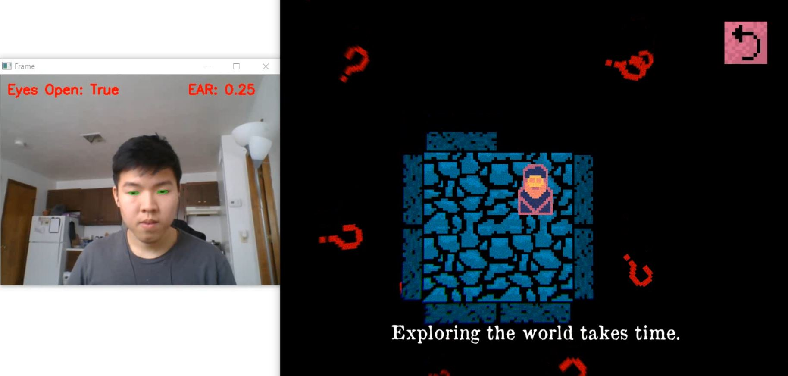
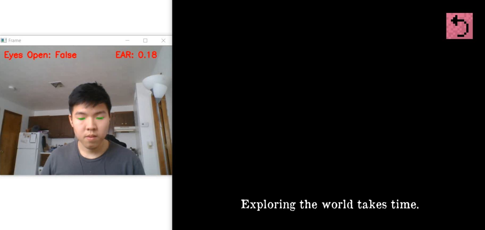

# Blind Side
Ludum Dare 45 Compo Entry

People who are born blind start with a view of the world that is unlike the rest of us. They experience the world through all the other senses and build a mental model of what they'd imagine the layout of the land to be.

They are born with nothing, but slowly and surely gain the knowledge and the skills to live fulfilling lives. I tried to explore that experience with Blind Side - the game that forces you to close your eyes.

Disclaimer: I am not partially or fully blind myself but I tried my best to do all the research I can on the subject. I definitely hope not to offend or hurt anyone who is blind or have loved ones who are.

GIF PREVIEW: 

### DOWNLOADS:
1. Python Executable: https://drive.google.com/open?id=1GRAnqrnysLWkyn7jaPeQXDeUl69VGtOh
2. Game Build: https://drive.google.com/open?id=16EOFo3fxTYWYVk6rVRNWknxk2YaN7nAt

### INSTALLATION:
1. Download and unzip both the game build and python executable folders.
2. For the python program, launch the .exe file in Final\dist\detect_eyes\detect_eyes.exe 
    - It works much better under good lighting so make sure your face gets #lit. Also, I suggest letting it run for a bit to see if it's working well with your face. I wanted to make something that users could calibrate with but ran out of time. As you can tell by the images below, the program is currently calibrated to my Asian eyes but should still work fine from testing.
    - You may need to launch it in admin mode at first. No viruses I promise, you can check out the code for yourself in the folder~ Or, you know, try me ;) 
3. For the game build, just run LudumDare45.exe in the GameBuild folder. I suggest a smaller aspect ratio while having the program to the side just to see if it's picking up your face properly.

### INSTRUCTIONS:
- W,A,S,D to move
- CLOSE EYES to explore the world (you cannot move to unexplored squares with your eyes open)
- OPEN EYES to see what you've previously explored as well as icons for the obstacles and goals in the level
- R to simulate opening and closing eyes if the python program is messed up and you want to play through the puzzle anyway! :) 

### NOTES:
- Audio cues are your best friend, pay close attention to the different (but similar) sounds to best navigate the puzzles.

- Research links down below on how people live with blindness, it was really eye opening (no pun intended). Specifically like to point out this research paper: https://pdfs.semanticscholar.org/6e90/115ff4c6696dd691b8e3f9a51735bc925cd8.pdf. They point out how people with blindness navigate new spaces which gave me the idea of exploring and revealing squares incrementally.

- Close your eyes to explore the world around you

- Open them to see what you've explored and move about freely

### CREDITS:
- https://www.pyimagesearch.com/2017/04/24/eye-blink-detection-opencv-python-dlib/
- https://www.raywenderlich.com/5475-introduction-to-using-opencv-with-unity
- https://www.youtube.com/channel/UCld5SlwHrXgAYRE83WJOPCw
- https://www.afb.org/blindness-and-low-vision
- https://www.perkins.org/stories/living-fearlessly-with-blindness
- https://www.nfb.org/images/nfb/publications/bm/bm14/bm1404/bm140414.htm
